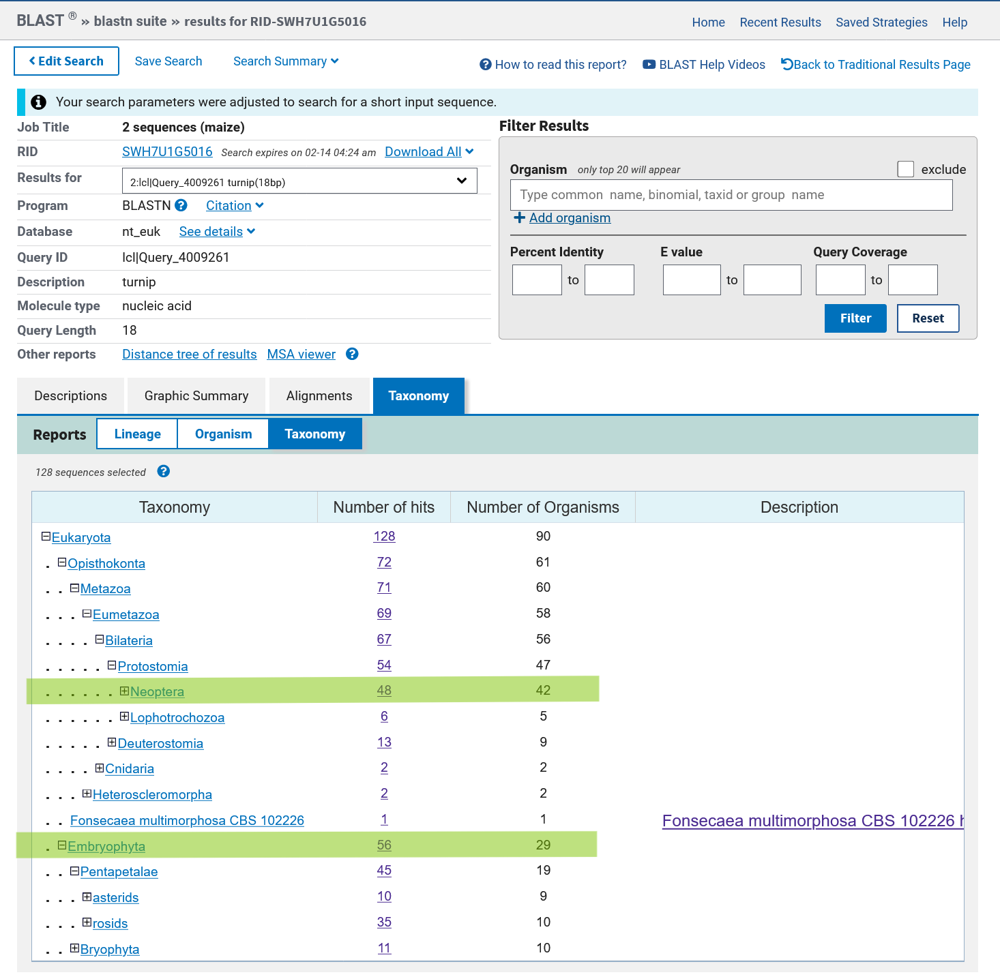

<!-- SOURCE: 2025_toys/poty.qmd (last modified 2026-06-29) — the core discovery document -->

## Executive summary

- A DNAzyme catalytic domain sequence matches perfectly to a region in the genomes of several potyviruses (6 species, 16 isolates)
- The flanking regions of the catalytic domain sequence in the viral genomes (16 sequences or isolates in total, among which 9 are identical by sequence) match perfectly to regions in the genomes of several eukaryotes, including plants, fungi and animals (including humans)
- Interactions between eukaryotic species indicate that homology might be based on cross-kingdom horizontal DNA transfer events
- The eukaryotic genes comprise genes with a wide variety of functions, including genes involved in DNA repair, transcription regulation, chromatin remodelling, RNA processing and translation, but also genes with unknown functions. Some of the genes are essential for cell survival and development.

## Intro

The starting point is a synthetic **10-23 deoxyribozyme** [@borggräfe2022]: a
single-stranded DNA whose two substrate-binding arms base-pair a target RNA
(Watson–Crick), positioning a 15-nt catalytic core that cleaves the RNA at an
unpaired purine·pyrimidine junction. Redrawn from the target/DNAzyme pairing:

```default
  target RNA   3'– A A C C C C A U U | C C A C G U A C A –5'
                   | | | | | | | | |   | | | | | | | | |
  DNAzyme      5'– T T G G G G T A A   G G T G C A T G T –3'
                     binding arm       binding arm
                 catalytic core: 5'– G G C T A G C T A C A A C G A –3'
```

The RNA is cleaved at the unpaired junction (`|`) between the two arms. The
15-nt catalytic core `GGCTAGCTACAACGA` — the part with no base-pairing role in
recognition — is the sequence that turns out to match the potyvirus CI coding
region (below). *Scheme redrawn after Borggräfe et al. 2022 [@borggräfe2022];
no figure is reproduced.*

### The answer to life, the universe and everything...

It's OK not to fit in any of the norm-sized boxes people like to stuff other
people in. I am not a payload, after all. If I would, my box would be a plant
biology box and I spend more time in one of these boxes than I should have.
Luckily, I had mentors that supported thinking out of the box. The box that I
have never fit in comfortably, anyways. I am not sure yet, how huge these
findings are. It all seems to simple to never have been found by anyone else. I
am not completely sure whether it really is another - and probably quite broad
and certainly unusual sort of horizontal - cross-kingdom DNA transfer that maybe
even dates back to evolution prior to what we define as "the origin of life".
So, yep. This might be the answer to life, (the universe) and everything.
Evolution that maybe happened in a world before cells. Maybe not ... but
everything starts from an in vitro system. To be precise: it starts from a
DNAzyme that was published in Borggräfe et al. 2022, which is a paper about a
DNAzyme that can cleave RNA in a sequence specific manner. The catalytic domain
of the DNAzyme is 15bp long and has the sequence "GGCTAGCTACAACGA". Flanking
this sequence is a region comprising (at least) 9 bases on both sides of the
active loop, which determine the specificity of the DNAzyme, i.e. the RNA it is
able to cleave.

Since I was curious whether this system might also occur in nature, I blasted
this sequence against the viral nucleotide collection on NCBI and found that it
matches perfectly to a region in the genomes of several potyviruses.

# Origins

```{r setup}
#| include: false
library(Biostrings)
library(plyranges)
library(magrittr)
library(BSgenome)
library(msa)
library(ggseqlogo)
library(ggplot2)
library(tidyverse)
library(rentrez)
library(treeio)
library(metacoder)
library(phyloseq)
library(ggtree)
library(ape)
```

## Blasting the catalytic center of a DNAzyme

I had blasted the catalytic domain of the DNAzyme in Borggräfe et al. 2022.

Borggräfe, J., Victor, J., Rosenbach, H., Viegas, A., Gertzen, C. G., Wuebben,
C., ... & Etzkorn, M. (2022). Time-resolved structural analysis of an
RNA-cleaving DNA catalyst. Nature, 601(7891), 144-149.

I was curious, whether they (DNAzyme(s)) might exist or have existed in nature.
That's also why I initially screened the experimental virus database (as opposed
to picking one for "higher" organisms) available in NCBI blast. I set the search
parameters, so that it worked with short input sequences, not allowing any
mismatches or gaps (blast will adjust some settings accordingly when the query
is short).

#### Blast Version:

BLASTN 2.17.0+

#### BlastSearchID (RID):

SHEST00P014

#### Blast Reference:

Stephen F. Altschul, Thomas L. Madden, Alejandro A. Schäffer, Jinghui Zhang,
Zheng Zhang, Webb Miller, and David J. Lipman (1997), "Gapped BLAST and
PSI-BLAST: a new generation of protein database search programs", *Nucleic Acids
Res.* 25:3389-3402.

#### Blast Database

|                         |                                   |
|-------------------------|-----------------------------------|
| **Title**               | Viruses nt                        |
| **Description**         | The Viruses nucleotide collection |
| **Molecule Type**       | mixed DNA                         |
| **Update date**         | 2026/02/08                        |
| **Number of sequences** | 12015938                          |

#### Search Parameters:

|                           |        |
|---------------------------|--------|
| **Program**               | blastn |
| **Word size**             | 7      |
| **Expect value**          | 1000   |
| **Hitlist size**          | 100    |
| **Match/Mismatch scores** | 1,-3   |
| **Gapcosts**              | 5,2    |
| **Filter string**         | F      |
| **Genetic Code**          | 1      |

As my query was a 15mer and the database is far from small, I had naively
expected that I should get some hits by chance alone already, which I suspected
should be more or less randomly distributed over a couple of probably very
different (i.e. not necessarily closely related) species.

The search retrieved 16 isolates assigned to a total of 6 species, all belonging
to the same family: Potyvirus.

```{r}
potydesc <- read_csv(here::here("data", "SHEST00P014-Alignment-Descriptions.csv"))
potydesc
```

```{r}
viral <- potydesc %>%
  dplyr::select(
    c(taxid = Taxid,
      name = `Scientific Name`,
      acc_len = `Acc. Len`,
      acc = Accession)) %>%
  dplyr::mutate(
    acc = str_extract(acc, "(^.*nucleotide.)(.*)(.report.*)", group = 2)
    )
viral
```

```{r}
viral %>% group_by(name) %>% summarise(n_isolates = n_distinct(acc))
```

```{r}
viraltax <- viral %>% dplyr::select(c(taxid, name)) %>% distinct() %>% pull(var = taxid, name = name)
viraltax
```

## Potyvirus

In the code below, I load the genomes (whole sequences, respectively). They are
viruses - so the file is not that huge. So, here I first load all potyvirus
isolates with a match for the catalytic domain:

```{r}
poty <- readDNAStringSet(here::here("data", "seqdump.txt"))
poty
```

Next, I search the regions with the matches to the 15 bases I had searched. I do
this, because I next want to extract the flanking sequences, i.e. the regions,
which - if the 15 bases indeed belonged to a natural DNAzyme - would determine
the target (RNA) specificity.

```{r}
potymatch <- GRanges(vmatchPattern("GGCTAGCTACAACGA", poty, max.mismatch = 0))
potymatch
```

### Potyvirus names

| Species                      | Common name                    |
|------------------------------|--------------------------------|
| Potyvirus ampeloprasi        | Leek yellow stripe virus       |
| Potyvirus batataplumei       | Sweet potato feathery mottle virus |
| Potyvirus zeananus           | Maize dwarf mosaic virus       |
| Ocimum potyvirus             |                                |
| Potyvirus rapae              | Turnip mosaic virus            |
| Zucchini yellow fleck virus  |                                |

### The fun part...

I then extracted and then blasted the 9+9bp flanking regions of the catalytic
domain(s) (i.e. the 18bp sequence that is matching the viral genomes). This time
I did not blast against the viral database. Instead, I went for the eukaryote
nucleotide collection in NCBI and found that it matches perfectly to a region in
the genomes of several eukaryotes.

## Extracting flanking sequences

Extracting the coordinates for the matched regions extended 9, 12 or 25 bp
upstream and downstream of match.

```{r}
potymatchflanksls <- lapply(c("9bp" = 18, "12bp" = 24, "25bp" = 50), function(x) plyranges::stretch(potymatch, x))
lapply(potymatchflanksls, width)
```

```{r}
potyseqsls <- lapply(potymatchflanksls, function(x) getSeq(poty, x))
potyseqlong <- getSeq(poty, potymatchflanksls$`25bp`)
names(potyseqlong) <- names(poty)
potyseqlong
```

### Cropping flanks for BLAST

Since long (25+25bp) flanks did not yield any blast hits, I crop down to 9bp
on each side (excluding the catalytic domain).

```{r}
tocrop <- IRanges(start = 26, end = 40)
tocroprightflank <- IRanges(start = 35, end = 50)
tocropleftflank <- IRanges(start = 1, end = 16)

potyseqcrop <- replaceAt(potyseqlong, tocrop, value = "")
potyseq18flank <- replaceAt(potyseqcrop, tocroprightflank, value = "")
potyseq18flank <- replaceAt(potyseq18flank, tocropleftflank, value = "")
```

```{r}
uniqueflanks <- unique(potyseq18flank)
uniqueflanks
# writeXStringSet(uniqueflanks, filepath = here::here("data", "unique18flanks.fasta"))
```

#### Translation (6-frame)

```{r}
translated <- Biostrings::translate(uniqueflanks)
translated

dna_subseqs <- lapply(1:3, function(pos)
    subseq(c(uniqueflanks, reverseComplement(uniqueflanks)), start = pos))
translatedsix <- lapply(dna_subseqs, Biostrings::translate)
translatedsix
```

### Sequence logo of viral flanks

First, I check whether there is any conservation in the viral sequences beyond
the putative catalytic domains, using a seqlogo generated from the extended-flank
segments (25bp flank + 15bp catalytic center + 25bp flank) of all 16 viral genomes.

```{r pfm}
pfm <- consensusMatrix(potyseqsls$`25bp`)
```

```{r}
#| fig-width: 12
#| fig-height: 3
#| fig-cap: "Sequence logo of the 25-nt DNAzyme-matching region across Potyviridae isolates; letter height is information content (bits), so tall stacks mark near-invariant positions."
seqlogo <- ggseqlogo(pfm, seq_type = 'dna')
seqlogo
```

```{r}
#| fig-width: 12
#| fig-height: 3
#| fig-cap: "The same region with the 15-nt 10-23 catalytic core highlighted (grey box, positions 26-40); the core is the most conserved stretch of the alignment."
ggplot() +
  annotate('rect', xmin = 25.5, xmax = 40.5, ymin = -0.05, ymax = 2.05,
           alpha = .5, col = 'black', fill = 'grey') +
  geom_logo(pfm, stack_width = 0.90, seq_type = "dna") +
  annotate('text', x = 33, xmax = 40.5, y = 2.2, label = 'catalytic15') +
  theme_logo()
```

### FunFacts

Plant viruses:
"Plant viruses are grouped into 73 genera and 49 families. However, these figures
relate only to cultivated plants, which represent only a tiny fraction of the total
number of plant species."

On the CI protein (which is where the DNAzyme motif often seems to be located):
"CI (~71 kDa) is an RNA helicase with ATPase activity. Its most unusual property
is its ability to form large and highly symmetrical conical and cylindrical inclusions
with a central hollow cylinder from which laminate sheets radiate outward and fold
in on themselves in a pattern often described as 'pinwheels'."

# Transduction?

## BLAST and data wrangling

I used the `uniqueflanks` exported as a fasta and blasted all of these 9 (9bp+9bp
flank seqs) against the experimental eukaryote_nt database on NCBI.

#### BlastSearchID (RID):

SEAFGD7E014

#### Blast Database

|                         |              |
|-------------------------|--------------|
| **Title**               | Eukaryota nt |
| **Molecule Type**       | mixed DNA    |
| **Update date**         | 2026/02/06   |
| **Number of sequences** | 99327899     |

#### Search Parameters:

|                           |        |
|---------------------------|--------|
| **Program**               | blastn |
| **Word size**             | 7      |
| **Expect value**          | 1000   |
| **Hitlist size**          | 500    |
| **Match/Mismatch scores** | 1,-3   |
| **Gapcosts**              | 5,2    |
| **Filter string**         | F      |

### Blast Hits and Descriptions

```{r}
blasthits <- read_delim(here::here("data", "HitTable_mod.txt"))
bhits <- blasthits %>% dplyr::filter(alignment_length == 18)
```

```{r}
bhits <- dplyr::select(bhits, c(Query, query_accver, seqname = subject_accver, s_start, s_end))

bhits <- bhits %>%
  dplyr::mutate(
    strand = case_when(bhits$s_end <= bhits$s_start ~ "-",
                       bhits$s_end >= bhits$s_start ~ "+"),
    start = case_when(strand == "+" ~ s_start, strand == "-" ~ s_end),
    end   = case_when(strand == "+" ~ s_end,   strand == "-" ~ s_start))
bhits
```

```{r}
descs <- read_delim(here::here("data", "DescriptionTable_mod.txt"))
descs <- descs %>%
  dplyr::rename(c(Description = `Description `,
                  seq_acc = `Select for downloading or viewing reports`,
                  name = `Scientific Name `,
                  taxid = `Taxid `,
                  acc_len = `Acc. Len `,
                  acc = Accession,
                  query = Query)) %>%
  dplyr::mutate(
    seq_acc = str_replace(seq_acc, "Select seq ", ""),
    Description = case_when(
      str_detect(Description, ", chromosome ") ~
        str_replace(Description, ", chromosome ", " chromosome: "),
      str_detect(Description, " chromosome ") ~
        str_replace(Description, " chromosome ", " chromosome: "),
      str_detect(Description, "chromosome ") ~
        str_replace(Description, "chromosome ", "chromosome: "),
      TRUE ~ Description),
    chromosome = case_when(
      str_detect(Description, "chromosome: ") ~
        str_extract(Description, "chromosome: .*") %>%
        str_replace("chromosome: ", ""),
      TRUE ~ NA_character_),
    misc = case_when(
      str_detect(Description, " genome assembly") ~ "genome assembly",
      str_detect(Description, "cultivar") ~ str_extract(Description, "cultivar.*"),
      str_detect(Description, "isolate") ~ str_extract(Description, "isolate.*"),
      str_detect(Description, "strain")  ~ str_extract(Description, "strain.*"),
      TRUE ~ NA_character_),
    query_acc  = str_extract(query, "(^.*\\.1)(.*virus)(.*)", group = 1),
    query_name = str_extract(query, "(^.*\\.1 )(.*virus)(.*)", group = 2))
descs
```

```{r}
hits <- left_join(bhits, descs, by = c("Query" = "query", "seqname" = "seq_acc"))

lengths <- hits %>% dplyr::select(acc_len, seqname) %>% distinct() %>%
  dplyr::pull(., var = acc_len, name = seqname)

hitsgr <- makeGRangesFromDataFrame(hits, seqnames.field = "seqname",
                                   seqinfo = lengths, keep.extra.columns = TRUE)
hitsgr
```

#### Retrieve sequences for extended ranges from Entrez

```{r}
bhitsstretched <- hitsgr %>% plyranges::stretch(., 3000)
bhitsstretchedtb <- as_tibble(bhitsstretched) %>%
  dplyr::mutate(region = paste0(acc, ".", strand, ":", start, "-", end))
bhitstb <- as_tibble(hitsgr)
```

```{r}
bhitstb %>% group_by(name) %>%
  summarise(n_isolates = n_distinct(name), n_chromosome = n_distinct(chromosome)) %>%
  arrange(desc(n_isolates)) %>% arrange(desc(n_chromosome))
```

```{r}
# Run once then read from file — avoid spamming NCBI
# potytools::fetch_custom_sequences(bhitsstretchedtb, output_file = here::here("data", "seqs3018bp.fasta"))

stretchedseqs <- readDNAStringSet(here::here("data", "seqs3018bp.fasta"))
uniquestretchedseqs <- unique(stretchedseqs)
names(uniquestretchedseqs) <- gsub(names(uniquestretchedseqs), pattern = " ", replacement = "_")
# writeXStringSet(uniquestretchedseqs, filepath = here::here("data", "uniquestretchedseqs.fasta"))
```

```{r coordinatesfromnames}
extract_ncbi_coords <- function(x) {
  nms <- if (methods::is(x, "XStringSet")) names(x) else x
  pattern <- "([A-Z0-9_]+\\.[0-9]+)\\.([+-]):(-?[0-9]+)-(-?[0-9]+)"
  m <- regexec(pattern, nms)
  matches <- regmatches(nms, m)
  do.call(rbind, lapply(matches, function(x) {
    if (length(x) == 5) {
      data.frame(full_name = x[1], seqname = x[2], strand = x[3],
                 start = as.integer(x[4]), end = as.integer(x[5]),
                 stringsAsFactors = FALSE)
    } else {
      data.frame(full_name = paste0(x), seqname = NA, strand = NA,
                 start = NA, end = NA, stringsAsFactors = FALSE)
    }
  }))
}

extract_ncbi_granges <- function(x) {
  df <- extract_ncbi_coords(x)
  GenomicRanges::makeGRangesFromDataFrame(df, keep.extra.columns = TRUE)
}
```

```{r biostringtogranges}
library(GenomicRanges)
library(IRanges)

biostring_to_granges <- function(dna) {
  if (!methods::is(dna, "XStringSet"))
    stop("Input must be a DNAStringSet or other XStringSet")
  df <- extract_ncbi_coords(dna)
  gr <- GRanges(
    seqnames = df$seqname,
    ranges   = IRanges(start = df$start, end = df$end),
    strand   = df$strand)
  mcols(gr)$sequence <- dna
  gr
}

greal <- biostring_to_granges(stretchedseqs)
greal
```

```{r}
filteredstretchedshort  <- stretchedseqs[(width(stretchedseqs) <= 1018)]
filteredstretchednotshort <- stretchedseqs[(width(stretchedseqs) >= 1018)]
filteredstretchedmedium <- filteredstretchednotshort[(width(filteredstretchednotshort) <= 2018)]
filteredstretched <- stretchedseqs[(width(stretchedseqs) >= 2018)]

stretched1018bp <- subseq(filteredstretched, 1001, 2018)
allstretched <- c(stretched1018bp, filteredstretchedmedium, filteredstretchedshort)
allstretched
```

## Taxonomy

```{r}
taxinfo <- read_delim(here::here("data", "tax_report.txt")) %>%
  dplyr::select(taxid, name = taxname, lineage)

lin <- str_split(taxinfo$lineage, pattern = " ")
names(lin) <- taxinfo$taxid

lindf <- enframe(lin) %>% unnest() %>%
  dplyr::rename(c(taxid = name, parent_tax = value))
```

The `filtree` object corresponds to the unique taxids in descvir and their
lineage, downloaded from the NCBI taxonomy tool "common tree".

```{r}
filtree    <- treeio::read.tree(here::here("data", "filtertips_coll.phy"))
filtreeape <- ape::read.tree(here::here("data", "filtertips_coll.phy"))

tm_hits <- readRDS(file = here::here("data", "tm_hits.rds"))
taxdat  <- tm_hits$data$tax_data
taxdf   <- taxdat %>% dplyr::rename(label = ncbi_name, taxid = ncbi_id)
```

#### Tree of blast hits

```{r trees}
filtreefortified <- fortify(filtree)
treetblfortified <- fortify(as_tibble(filtree))

filtreefortified$label <- gsub("\\'", "", filtreefortified$label)
treetblfortified$label <- gsub("\\'", "", treetblfortified$label)

filtreedf <- left_join(filtreefortified, taxdf, by = "label")

viralquery <- viral %>%
  dplyr::rename(query_taxid = taxid, query_name = name,
                query_acc = acc, query_acc_len = acc_len)
descvir    <- left_join(descs, viralquery)
taxpervir  <- descvir %>%
  pivot_wider(names_from = query_acc, values_from = taxid) %>%
  dplyr::select(c(label = name, query_name, query_taxid)) %>%
  group_by(label) %>%
  summarise(across(.cols = c(query_name, query_taxid),
                   \(x) paste0(unique(x), collapse = "; ")))
filtreedf <- left_join(filtreedf, taxpervir, by = "label")
```

```{r}
ft_nodelabs <- filtreedf %>% dplyr::filter(ncbi_rank == "phylum") %>%
  dplyr::select(node, label)
ft_tiplabs  <- filtreedf %>% dplyr::filter(isTip) %>%
  dplyr::select(c(label, node, query_name))

ft    <- ggtree(filtreedf, layout = "circular")
ftdl  <- ggtree(as.phylo(filtreefortified), layout = "daylight")

ft +
  geom_tippoint(aes(node = node, color = query_name)) +
  geom_highlight(ft_nodelabs, aes(node = node, fill = label), alpha = 0.2)

ftdl +
  geom_highlight(ft_nodelabs, aes(node = node, fill = label), alpha = 0.4)
```

```{r}
perparentphylo   <- lapply(ft_nodelabs$node, function(x) offspring(filtreefortified, x))
names(perparentphylo) <- ft_nodelabs$label
perparentphylodf <- data.table::rbindlist(perparentphylo, idcol = "phylum")

pdat  <- perparentphylodf %>% dplyr::group_by(phylum) %>% tally() %>% arrange(desc(n))
ft_phyla <- ft_nodelabs %>% dplyr::rename(phylum = label)
pdat2 <- left_join(perparentphylodf, ft_phyla) %>% left_join(., pdat) %>%
  arrange(desc(n)) %>% dplyr::filter(isTip)

ggplot(pdat2, aes(y = reorder(phylum, n), fill = phylum)) +
  geom_bar(show.legend = FALSE) +
  theme_minimal() +
  theme(axis.title.y = element_blank())

pdat3 <- perparentphylodf %>% left_join(., filtreedf) %>% dplyr::filter(isTip) %>%
  group_by(query_name, phylum) %>% tally() %>% arrange(desc(n))

ggplot(pdat3, aes(x = n, y = phylum, fill = query_name)) +
  geom_bar(stat = "identity") +
  theme_minimal() +
  theme(axis.title.y = element_blank())
```

### Implications part I

Now the crazy part. For these two examples (sequences based on a) a Turnip mosaic
virus and b) a maize dwarf something virus, the flanking regions appeared to occur
MASSIVELY enriched in very specific clades:

1.  **Plants.**
    1.  The fact that the viruses appear to leave traces in the genomes of putative
        hosts is pretty "wow" already. These viruses are no retroviruses, which in turn
        are indeed known to insert their genomes or parts of it in that of their hosts.
        Secondly, because it is not a continuous part of the viral genome, but specifically
        one that matches a DNAzyme TARGET only (without the catalytic loop thingy in the
        middle, that still is present in the virus).
    2.  Another thing I think is interesting is that when I searched the Turnip virus
        sequences, I did not find ANY monocotyledons (Turnip is a dicotyledonous plant).
        When I tried with the Maize flanks, the hits however did indeed include monocotyledonous
        plants. (And wine btw, and cassava).

2.  **Insects**
    1.  But not just any insects. Pollinators!!!!
    2.  This is not only indicating that DNAzymes might have existed in nature,
        but also that they might have been transferred between species and even
        kingdoms. Here's the origin of life ... right in front of us.



```{r}
annotated <- descvir %>%
  dplyr::filter(str_detect(seq_acc, "_") | str_detect(Description, "mRNA")) %>%
  dplyr::rename(seqname = seq_acc) %>%
  left_join(., hits) %>%
  select(-c("s_start", "s_end", "Max Score ", "Total Score ",
            "Query Cover ", "E value ", "Per. Ident ", "chromosome", "misc"))
annotated
```

#### Strawberry

```{r}
strawberry <- descvir %>%
  dplyr::filter(str_detect(name, "Fragaria")) %>%
  dplyr::rename(seqname = seq_acc) %>%
  left_join(., hits) %>%
  select(-c("s_start", "s_end", "Max Score ", "Total Score ",
            "Query Cover ", "E value ", "Per. Ident ", "chromosome", "misc"))
strawberry
```

```{r}
strawberryseqs <- stretchedseqs[(which(str_detect(names(stretchedseqs), "Fragaria")))]
strawberryseqs
# writeXStringSet(strawberryseqs, here::here("data", "strawberryseqs.fasta"))
```

Some of the annotated hits include:

1.  **MIZU-KUSSEI 1**: involved in hydrotropism and induced by ABA. Related to chromatin remodelling and potentially hypomethylation, which might trigger transposon activity.
2.  **myosin-VIIa-like**: motor protein.
3.  **SH3 domain protein**: PI3 Kinase, Ras GTPase-activating protein, CDC24 signalling.
4.  **calcineurin binding protein 1**: CAIN — negative regulator of NFAT-dependent signalling.
5.  **ATP-dependent RNA helicase DHX40**: associated with colorectal and haematological neoplasia.
6.  **leucine rich repeat domain containing protein**: effector signalling, innate immunity.
7.  **DEAH box helicase 9**: plays a role in HIV, binds RISC loading complex.

Sounds a lot like immune-related stuff. Update months later: Of course it does resemble
some helicase — the sequence is part of CI, which is a helicase. Somewhat expected.

## Chromosomal positions of blast hits

```{r}
#| fig-height: 12
#| fig-cap: "Relative chromosomal position (hit end / accession length) of each eukaryotic BLAST hit, one point per hit, faceted by query. Consistent positioning across hosts would indicate the flanks map to defined host loci rather than dispersed repeats."
plotdatbhits <- hits %>%
  dplyr::mutate(relative = end/acc_len) %>%
  dplyr::select(c(acc_len, start, end, seqname, name, Description, query_acc, relative))

ggplot(plotdatbhits, mapping = aes(x = relative, y = name, color = name)) +
  geom_point(alpha = 0.4) +
  theme_minimal() +
  theme(axis.title.y = element_blank(), legend.position = "none") +
  facet_wrap(query_acc~., scales = "free_y")
```

```{r densityoverchromplot}
#| fig-cap: "Density of the same BLAST hits along the relative chromosomal position, faceted by query — summarising where on their host chromosomes the flanking-region homologs concentrate."
ggplot(plotdatbhits, mapping = aes(x = relative)) +
  geom_density(alpha = 0.4) +
  theme_minimal() +
  theme(axis.title.y = element_blank()) +
  facet_wrap(query_acc~., scales = "free_y")
```

## Corrected analysis (2026-02-14)

Update 2026-02-14: There is an additional nucleotide in the target sequences that
can be any base.

```{r}
tocrop <- IRanges(start = 26, end = 40)
tocroprightflanknew <- IRanges(start = 36, end = 51)
tocropleftflank     <- IRanges(start = 1,  end = 16)

potyseqnewcrop    <- replaceAt(potyseqlong, tocrop, value = "N")
potyseq18flanknew <- replaceAt(potyseqnewcrop, tocroprightflanknew, value = "")
potyseq18flanknew <- replaceAt(potyseq18flanknew, tocropleftflank, value = "")
potyseq18flanknew
```

```{r}
uniqueflanksnew  <- unique(potyseq18flanknew)

uniqueflanksnewG <- replaceAt(uniqueflanksnew, IRanges(start = 10, end = 10), value = "G")
uniqueflanksnewC <- replaceAt(uniqueflanksnew, IRanges(start = 10, end = 10), value = "C")
uniqueflanksnewA <- replaceAt(uniqueflanksnew, IRanges(start = 10, end = 10), value = "A")
uniqueflanksnewT <- replaceAt(uniqueflanksnew, IRanges(start = 10, end = 10), value = "T")

uniqueflanksnewGrc <- reverseComplement(uniqueflanksnewC)
uniqueflanksnewCrc <- reverseComplement(uniqueflanksnewG)
uniqueflanksnewArc <- reverseComplement(uniqueflanksnewT)
uniqueflanksnewTrc <- reverseComplement(uniqueflanksnewA)
```

```{r}
#| fig-cap: "Number of near-identical BLAST hits (≥99 % query coverage) per query flank, quantifying how widely each reverse-complement flank is shared across eukaryotic genomes."
oops    <- list.files(here::here("data"), pattern = "rc_G0_Blasthits.txt", full.names = TRUE)
oopsaln <- read_delim(oops, delim = "\t")

rc_G <- oopsaln %>%
  dplyr::mutate(query_cover_num = as.numeric(stringr::str_remove(query_cover, "%"))) %>%
  dplyr::filter(query_cover_num >= 99)

rc_G %>% ggplot(aes(y = query)) + geom_bar() + theme_minimal() +
  labs(x = "number of identical blast hits", y = "")
```

```{r}
#| fig-cap: "Neighbour-joining tree of the eukaryotic species bearing the flanking-region hits; internal nodes labelled with major clades (Embryophyta, Arthropoda, …) and tips coloured by the associated potyvirus, showing the cross-kingdom spread of the flanks."
newtree  <- read.tree(here::here("data", "phyliptreeunex.phy"))
newtreef <- fortify(newtree)
ftdl2    <- ggtree(as.phylo(newtreef), layout = "daylight")

labelinodes <- c("Hexapoda", "Arthropoda", "Neoptera", "Embryophyta")

df <- newtreef %>%
  dplyr::mutate(labelinodes = case_when(
    newtreef$label %in% labelinodes ~ paste0(label),
    TRUE ~ NA))

rc_G$species <- gsub(" $", "", rc_G$species)
rc2G <- rc_G %>% dplyr::mutate(label = paste0("'", species, "'"))

df2 <- left_join(df, rc2G) %>%
  dplyr::mutate(virus = case_when(
    str_detect(query, "Maize")   ~ "Maize dwarf mosaic",
    str_detect(query, "Leek")    ~ "Leek yellow stripe",
    str_detect(query, "potato")  ~ "Sweet potato f.m.",
    str_detect(query, "Ocimum")  ~ "Basil putative",
    str_detect(query, "Turnip")  ~ "Turnip mosaic virus"))

ggtree(df2) + geom_tiplab() +
  geom_nodelab(mapping = aes(label = labelinodes)) +
  geom_tippoint(mapping = aes(color = virus)) +
  xlim(0, 150) + ylim(0, 60)
```

### Some more?

The 10-23 deoxyribozyme has been structurally characterised in a homodimer
conformation [@cramer2023]. Its target / catalytic-core arrangement is:

| | 5' | cat | 3' |
|---|---|---|---|
| Target | | a | |
| DNAzyme | gcacaatg | ggctagctacaacga | atccccag |

The related **8-17 DNAzyme** can operate in a single active structure regardless
of the metal-ion cofactor [@wieruszewska2024]. There the catalytic domain
corresponds to 5' GCCAGCGCCTCGAA 3', and the target harbours an additional
nucleotide between the specificity-determining flanks.

## Open Questions, Outlook, Thoughts

Is this the only example? What is a computationally reasonable way to find analogous
events and potentially their viral/bacterial/molecular sources?

### Statistics

Likelihoods:

- What is the likelihood of finding any random 18mer in a database of a given size?
- What is the expected distribution of hits for random 18mers among different groups
  within the database?
- Can I pinpoint the time of insertion of the viral sequence into the host genome?

### The RNA argument

> "but the virus is RNA!!?"

An RNA genome is not an obstacle: genome sequences of non-retroviral RNA viruses
are **widely endogenized into plant genomes** [@chiba2011], providing a precedent
for the DNA-level integration of a (+)-strand RNA virus sequence proposed here.

"The pattern of occurrence of NRVSs and the phylogenetic analyses of NRVSs and related
viruses indicate that multiple independent integrations into many plant lineages may have
occurred."

## Multilayer Network analysis

#### Resources

1. <https://www.globalbioticinteractions.org/>
2. <https://www.web-of-life.es/>
3. <https://www.nceas.ucsb.edu/interactionweb/>
4. <https://mangal.io>
5. <https://ecologicaldata.org/>
6. <https://www.try-db.org>
7. <https://knb.ecoinformatics.org>
8. <https://www.gbif.org>

### Species by Potyvirus

```{r taxpervirus}
taxbyvir <- descvir %>%
  group_split(query_name) %>%
  lapply(., function(x) pull(x, var = "name")) %>%
  setNames(unique(descvir$query_name))
taxbyvir$`Leek yellow stripe virus`
```

###### Additional References

Foster ZSL, Sharpton TJ, Grünwald NJ (2017) Metacoder: An R package for
visualization and manipulation of community taxonomic diversity data. PLOS
Computational Biology 13(2): e1005404.

#### Session Info

```{r}
sessioninfo::session_info()
```
